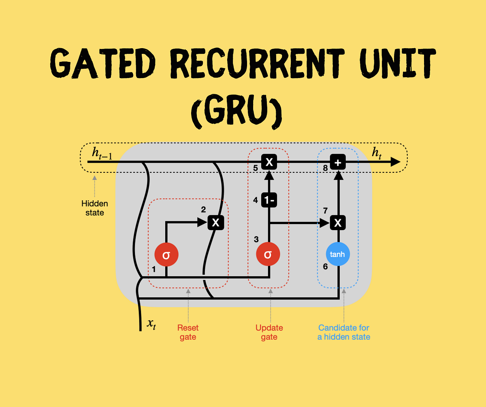
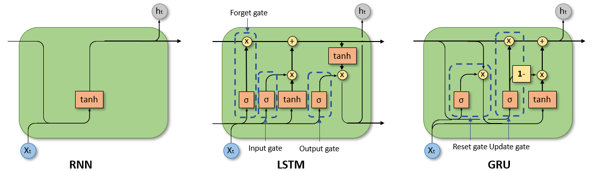

# RNN-LSTM-GRU-PyTorch

## RNN (Recurrent Neural Network)


- Simple RNN
- Needs `input and hidden state`
- Outputs `hidden state and output`
```python
import torch
import torch.nn as nn

# hidden_state_size = 20
# each input embedded to vector of size 10
# 2 layers
rnn = nn.RNN(input_size=10, hidden_size=20, num_layers=2) 

# seq_len(number of words in each sentence), batch (at one time 3 different sentences will be input), input_size (each word is embedded to vector of size 10)
input = torch.randn(5, 3, 10) 

# initial hidden state (2 layers, 3 sentences (batch), 20 size vector for representing hidden state)
h0 = torch.randn(2, 3, 20)
output, hn = rnn(input, h0)
print(output.shape, hn.shape)

# output contains output state for each layer
# hn contains hidden state for each layer

output_last_layer = output[-1] # output for last layer
hn_last_layer = hn[-1] # hidden state for last layer
```

---

## LSTM (Long Short Term Memory)

- https://pytorch.org/docs/stable/generated/torch.nn.RNN.html
- Complex RNN
- Needs `input, hidden state and cell state`
- Outputs `hidden state, updated cell state and output`
```python
# similar to rnn
# but needs cell state as well
rnn = nn.LSTM(10, 20, 2)
input = torch.randn(5, 3, 10)
h0 = torch.randn(2, 3, 20)
c0 = torch.randn(2, 3, 20)
output, (hn, cn) = rnn(input, (h0, c0))
```


---

## GRU (Gated Recurrent Unit)

- https://pytorch.org/docs/stable/generated/torch.nn.GRU.html#torch.nn.GRU
- Simplified LSTM
- Needs `input and hidden state`
- Outputs `hidden state and output`
```python
rnn = nn.GRU(10, 20, 2)
input = torch.randn(5, 3, 10)
h0 = torch.randn(2, 3, 20)
output, hn = rnn(input, h0)
```

---

## RNN vs LSTM vs GRU 😎


 
